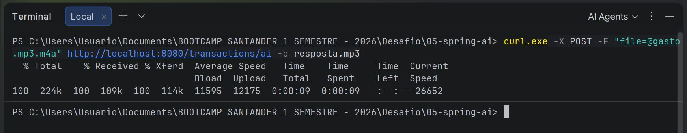
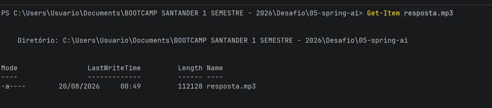
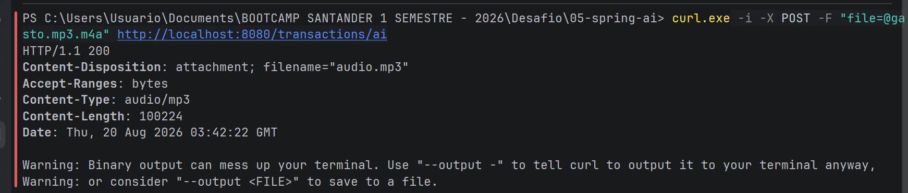
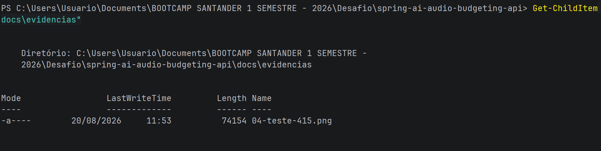

# 🤖 Spring AI - API Inteligente de Controle Financeiro

API desenvolvida em **Java, Spring Boot e Spring AI** para registro de transações financeiras por meio de comandos de voz.

Projeto desenvolvido como parte do desafio final do módulo de **Spring AI do Bootcamp Santander 1º Semestre de 2026**.

---

## 🎓 Contexto

Projeto desenvolvido durante o **Bootcamp Santander 1º Semestre de 2026**, no desafio final do módulo de **Spring AI**.

O desafio teve como foco a integração de recursos de Inteligência Artificial em uma API backend, utilizando processamento de voz, Tool Calling e geração de áudio.

Além da implementação do fluxo proposto, foi realizada uma melhoria de validação no endpoint de processamento de áudio, tornando a API mais robusta no tratamento de entradas inválidas.

---

## 🎯 Objetivo

Permitir o registro de transações financeiras utilizando comandos de voz.

O usuário envia um áudio, que é transcrito e interpretado pela Inteligência Artificial. A aplicação utiliza **Tool Calling** para acionar os casos de uso responsáveis pelo processamento da transação e, ao final, gera uma resposta em áudio.

**Exemplo:**

> "Gastei R$ 50,00 no mercado."

### 🔄 Fluxo principal

**Áudio → Speech-to-Text → ChatClient → Tool Calling → Caso de Uso → Persistência → Text-to-Speech → Áudio MP3**

---

## 🧠 Recursos de Inteligência Artificial

- 🎙️ **Speech-to-Text:** conversão do áudio em texto utilizando `TranscriptionModel`.
- 💬 **ChatClient:** processamento da solicitação utilizando Spring AI.
- 🔧 **Tool Calling:** acionamento dos casos de uso da aplicação a partir da interpretação da IA.
- 🔊 **Text-to-Speech:** conversão da resposta final em áudio utilizando `TextToSpeechModel`.

---

## 🏗️ Arquitetura

O projeto utiliza arquitetura em camadas, mantendo a separação entre domínio, aplicação e infraestrutura.

```text
src/main/java/dio/budgeting

├── domain
├── application
└── infrastructure
```

As principais responsabilidades são:

- **Domain:** modelos e contratos relacionados ao domínio financeiro.
- **Application:** casos de uso responsáveis pelas regras de negócio.
- **Infrastructure:** endpoints HTTP, persistência e integrações externas.

Os casos de uso são reutilizados pelos endpoints REST e pelo mecanismo de **Tool Calling**, mantendo as regras de negócio independentes da integração com a IA.

---

## ✨ Melhoria implementada

Além da implementação do fluxo de **Speech-to-Text, Tool Calling e Text-to-Speech**, foi implementada uma melhoria no endpoint `/transactions/ai` para aumentar a robustez da API.

### 🛡️ Validação do tipo de mídia

O endpoint passou a validar o tipo de conteúdo recebido antes de realizar o processamento do áudio.

Quando é enviada uma requisição com formato de mídia não suportado, a API retorna:

```text
HTTP 415 - Unsupported Media Type
```

Essa melhoria contribui para:

- maior robustez da API;
- validação das entradas;
- redução de chamadas inválidas ao serviço de IA;
- tratamento mais adequado de erros HTTP.

---

## 🧪 Evidências

Os testes realizados demonstram o funcionamento do processamento de áudio, a geração da resposta e o tratamento de uma requisição com formato não suportado.

### 🎙️ 1. Teste de áudio válido



### 🔊 2. Resposta de áudio gerada



### ✅ 3. Resposta HTTP 200



### ⚠️ 4. Validação HTTP 415



---

## 🛠️ Tecnologias

### 💻 Desenvolvimento

- Java
- Spring Boot
- Spring AI
- Gradle
- REST API

### 🤖 Inteligência Artificial

- OpenAI API
- Speech-to-Text
- Text-to-Speech
- ChatClient
- Tool Calling

### 🗄️ Persistência e infraestrutura

- JPA / Hibernate
- MySQL
- Docker / Docker Compose

### 🔧 Ferramentas

- Git
- GitHub

### 📐 Conceitos aplicados

- Arquitetura em camadas
- Domain-Driven Design (DDD)
- Clean Architecture
- Use Cases
- Repository Pattern
- Validação de entrada
- Tratamento de erros HTTP

---

## 📡 Endpoint principal

### 🎙️ Processamento de transação por áudio

```text
POST /transactions/ai
```

**Content-Type:** `multipart/form-data`

**Parâmetro:** `file`

Exemplo utilizando `curl`:

```bash
curl -X POST   -F "file=@gasto.mp3.m4a"   http://localhost:8080/transactions/ai   -o resposta.mp3
```

O endpoint recebe o áudio, realiza a transcrição, utiliza a Inteligência Artificial para interpretar a solicitação e retorna a resposta processada em formato de áudio.

O arquivo `resposta.mp3` é gerado localmente após o processamento.

> Os arquivos de áudio utilizados nos testes não fazem parte do repositório.

---

## 📌 Outros endpoints

### Criar transação

```text
POST /transactions
```

### Listar transações por categoria

```text
GET /transactions/{category}
```

---

## ⚙️ Como executar

### 📋 Pré-requisitos

- Java
- Docker Desktop
- Git
- Chave de API da OpenAI

### 🪟 Windows PowerShell

Configure a variável de ambiente:

```powershell
$env:OPENAI_API_KEY="sua_chave_aqui"
```

### 🐧 Linux/macOS

Configure a variável de ambiente:

```bash
export OPENAI_API_KEY="sua_chave_aqui"
```

> 🔐 **Nunca coloque sua chave da OpenAI diretamente no código ou no GitHub.**

### ▶️ Executar a aplicação - Windows

```powershell
.\gradlew.bat bootRun
```

### ▶️ Executar a aplicação - Linux/macOS

```bash
./gradlew bootRun
```

### 🧪 Executar os testes - Windows

```powershell
.\gradlew.bat test
```

### 🧪 Executar os testes - Linux/macOS

```bash
./gradlew test
```

---

## 📂 Estrutura do projeto

```text
spring-ai-audio-budgeting-api/
│
├── docs/
│   └── evidencias/
│       ├── 01-teste-audio-valido.jpg
│       ├── 02-resposta-audio-gerada.jpg
│       ├── 03-resposta-http-200.jpg
│       └── 04-teste-415.png
│
├── gradle/
│   └── wrapper/
│
├── src/
│   ├── main/
│   │   ├── java/
│   │   └── resources/
│   └── test/
│
├── .gitignore
├── build.gradle
├── compose.yml
├── gradlew
├── gradlew.bat
├── README.md
├── requests.http
└── settings.gradle
```

---

## 📚 Documentação

- 🌱 **Spring AI Reference**  
  https://docs.spring.io/spring-ai/reference/

- 💬 **ChatClient**  
  https://docs.spring.io/spring-ai/reference/api/chatclient.html

- 🔧 **Tools / Tool Calling**  
  https://docs.spring.io/spring-ai/reference/api/tools.html

- 🎙️ **Audio Transcriptions**  
  https://docs.spring.io/spring-ai/reference/api/audio/transcriptions.html

- 🔊 **Audio Speech**  
  https://docs.spring.io/spring-ai/reference/api/audio/speech.html

---

## 👩‍💻 Autora

**Juliane Vaz**

Desenvolvedora Back-End | Java | C#/.NET | Python

🔗 **GitHub:**  
https://github.com/JullyVaz
